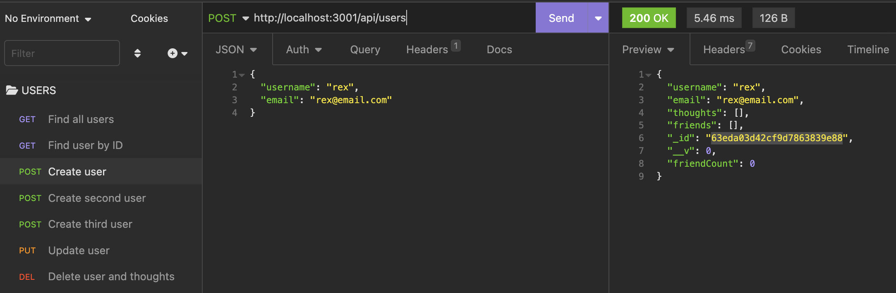

# Social Network API NOSQL

## Description
This project was a challenge assigned to us where we had to build an API for a social network web application where users can share their thoughts, react to friends’ thoughts, and create a friend list. Our API was built from scratch with no starter code. 

This week's challenge was an easier task to understand because we were using MongoDB instead of MySQL. When coding while using JavaScript syntax helped make using NOSQL a lot smoother than the previous challenge that included MySQL. I am still trying to fully grasp how to work in the back end, as I am not the strongest in that area yet.


## User Story

```md
AS A social media startup
I WANT an API for my social network that uses a NoSQL database
SO THAT my website can handle large amounts of unstructured data
```

## Usage


[**Link to Repository**](https://github.com/crzn24/social-network-api-nosql.git)





## Credits
* [Date.now](https://stackoverflow.com/questions/35501273/what-is-the-difference-between-date-now-and-date-now-in-mongoose)

## License
